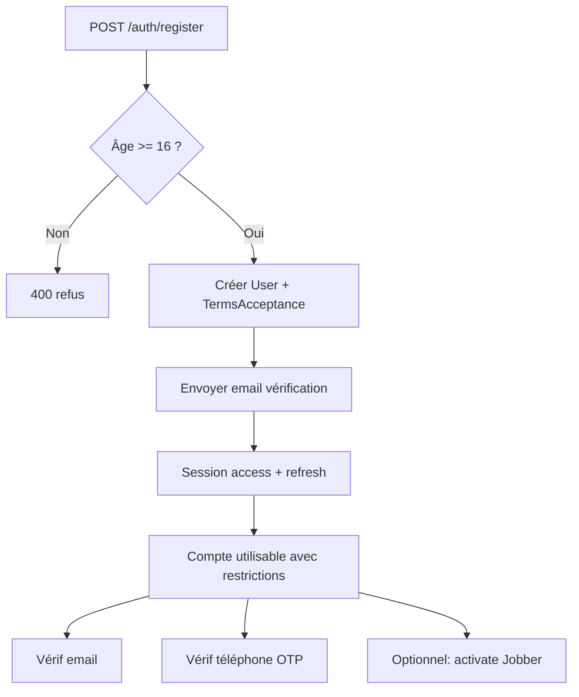
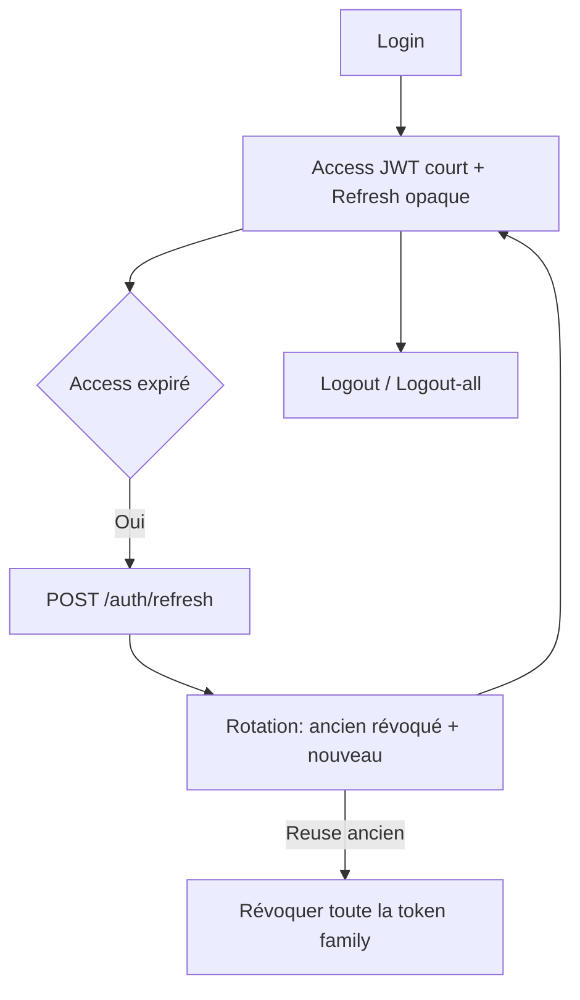
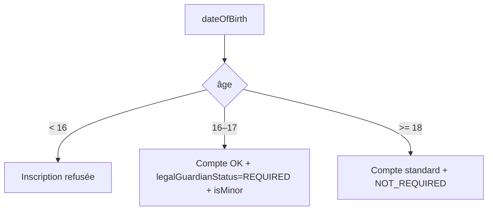

# Auth & Identity — KingJOBS API (Backend 02)

## Principe

```
UNE PERSONNE
     ↓
UN COMPTE User
     ↓
┌────────────┬────────────┐
│   CLIENT   │   JOBBER   │
│  (usage)   │  (usage)   │
└────────────┴────────────┘
```

- `UserRole` (`USER` / `ADMIN` / `SUPER_ADMIN`) est **séparé** des capacités Client/Jobber.
- Un Jobber n’est jamais admin par défaut.
- `ClientProfile` n’est **pas** créé à l’inscription (aucune donnée Client spécifique aujourd’hui).
- `JobberProfile` est créé via `POST /api/v1/jobbers/me/activate` (statut initial `DRAFT`).

## Register flow



## Session flow



## Minor flow



Le workflow représentant légal (PENDING/APPROVED…) est **préparé** via l’enum, non opérationnalisé.

## Tokens

| Type | Algo | Stockage |
| --- | --- | --- |
| Mot de passe | Argon2id | `password_hash` |
| Refresh / email / reset / OTP | SHA-256 | hash lookup |

JWT access payload minimal : `sub`, `sid`.

## Vérifications distinctes

- `emailVerifiedAt`
- `phoneVerifiedAt`
- `identityVerificationStatus` (reste `UNVERIFIED` après email/phone)

## Endpoints

### Auth
- POST `/api/v1/auth/register`
- POST `/api/v1/auth/login`
- POST `/api/v1/auth/refresh`
- POST `/api/v1/auth/logout`
- POST `/api/v1/auth/logout-all`
- POST `/api/v1/auth/forgot-password`
- POST `/api/v1/auth/reset-password`
- POST `/api/v1/auth/change-password`
- POST `/api/v1/auth/verify-email`
- POST `/api/v1/auth/resend-email-verification`
- POST `/api/v1/auth/phone/send-code`
- POST `/api/v1/auth/phone/verify`

### Users
- GET/PATCH `/api/v1/users/me`
- POST `/api/v1/users/me/close`

### Jobbers
- POST `/api/v1/jobbers/me/activate`
- GET/PATCH `/api/v1/jobbers/me`

## Providers

- **Email** : Resend si `RESEND_API_KEY`, sinon console (dev).
- **SMS** : `SMS_PROVIDER=console` (dev) ou `none` (prod → erreur explicite à l’envoi).

## Migration

`prisma/migrations/20261001140000_auth_identity` — crée uniquement les tables Nest auth.
Ne touche **pas** aux tables pré-lancement.

Deploy prod (manuel) :

```bash
npm run prisma:migrate:deploy
```
