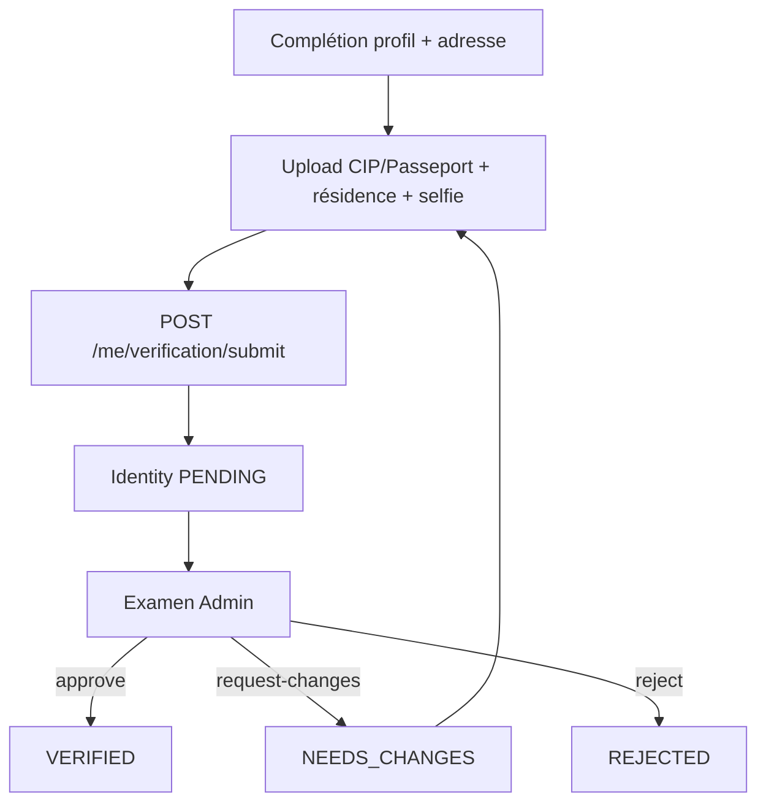

# Vérification d'identité (Backend 03)

Workflow KYC manuel : pièces uploadées, examen Admin, statut sur `User.identityVerificationStatus`.

## Source de vérité

| Concept | Champ / modèle |
| --- | --- |
| Identité personne | `User.identityVerificationStatus` |
| Dossier | `VerificationCase` (`kind = IDENTITY`) |
| Pièces | `UserDocument` + `DocumentType` (`CIP` / `PASSPORT`, `RESIDENCE_CERTIFICATE`, `LIVE_SELFIE`) |
| Historique pièce | `UserDocumentEvent` |
| Audit Admin | `AdminAuditEvent` |

Statuts identité : `UNVERIFIED` → `PENDING` → `VERIFIED` | `NEEDS_CHANGES` | `REJECTED`.

## Flux

## Pièces requises (identité)

Exactement une pièce d'identité (`CIP` ou `PASSPORT` via `identitySubType` ou type dédié), plus `RESIDENCE_CERTIFICATE`, plus `LIVE_SELFIE` (capture récente, TTL côté serveur).

Selfie : pas de face matching / OCR en V1. L'Admin compare manuellement à côté de la pièce.

## Endpoints utilisateur (`/api/v1`)

| Méthode | Route | Rôle |
| --- | --- | --- |
| GET | `/users/me/verification` | Statut identité, cas, éléments à corriger (sans notes internes ni storage keys) |
| GET | `/users/me/profile-completion` | Complétion identité (+ Jobber si profil) |
| PATCH | `/users/me/profile` | Adresse, langues, champs User autorisés |
| PATCH | `/users/me` | Prénom, nom, date de naissance (≥16, guardian si mineur) |
| POST | `/users/me/documents` | Upload multipart / buffer + métadonnées |
| GET | `/users/me/documents/:id/content` | Stream authentifié (propriétaire) |
| POST | `/users/me/verification/submit` | Soumet le dossier IDENTITY |

Interface Jobber : voir `WebSite/docs/WEBAPP-02-JOBBER-VERIFICATION.md`.

## Endpoints Admin

| Méthode | Route |
| --- | --- |
| GET | `/admin/verifications` / `counts` / `:id` |
| POST | `/admin/verifications/:id/approve` \| `request-changes` \| `reject` |
| GET/POST | `/admin/documents` (+ approve / reject / request-changes / content) |

Permissions Nest : `verifications.read` / `verifications.manage` (alias matrice `documents.*` côté WebSite).

## Gates métier

- **Publish Mission** : compte `ACTIVE` + identité `VERIFIED` + guardian non bloquant (`REQUIRED` / `PENDING` / `REJECTED` bloquent). Création DRAFT sans KYC autorisée.
- **Apply Jobber** : identité `VERIFIED` + `JobberProfile.status = ACTIVE` + éligibilité catalogue existante.

Messages d'erreur métier en français (pas de détails Prisma).

## Storage V1 / production

Voir `KYC-PRIVATE-STORAGE.md` (BO03.1) : `object_storage` S3-compatible en prod ; `local_private` interdit en production.

## Sécurité V1

- Pas de bulk approve.
- Notes internes et clés storage absentes des réponses USER.
- Self-review interdit (Admin ne peut pas traiter son propre dossier).
- Double approve concurrent → `409 Conflict`.
- Mineur / guardian : blocage validation opérationnelle avec message Admin clair.
