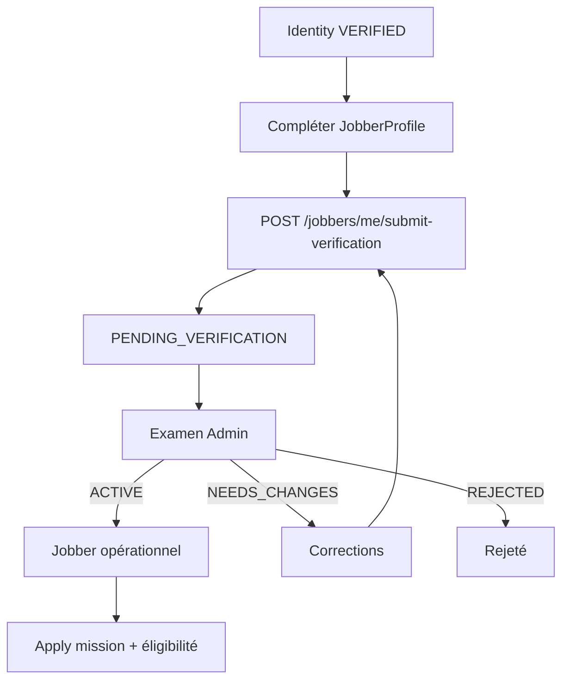

# Vérification du profil Jobber (Backend 03)

Le Jobber opérationnel exige une identité déjà `VERIFIED`, puis un examen Admin du profil professionnel (`VerificationCase.kind = JOBBER_PROFILE`).

## Source de vérité

| Concept | Champ / modèle |
| --- | --- |
| Statut Jobber | `JobberProfile.status` |
| Dossier | `VerificationCase` (`JOBBER_PROFILE`) |
| Compétences / qualités | `JobberSkill.kind` = `SKILL` \| `QUALITY` |
| Formations / expériences | `JobberEducation`, `JobberExperience` (optionnels) |
| Langues | `UserLanguage` (partagé, multi-lignes, sans niveau V1) |

Statuts Jobber : `DRAFT` → `PENDING_VERIFICATION` → `ACTIVE` | `NEEDS_CHANGES` | `REJECTED` | `SUSPENDED`.

## Flux

## Prérequis submit

- Identité `VERIFIED` (ou `PENDING` cohérent selon règles du service : en pratique l'approbation Jobber exige `VERIFIED`).
- Profil Jobber existant (`DRAFT` / `NEEDS_CHANGES`).
- Complétion minimale (bio, compétences, etc. selon `IdentityCompletionService` / completion Jobber étendue).

## Endpoints

| Méthode | Route | Description |
| --- | --- | --- |
| POST | `/jobbers/me/submit-verification` | Crée / resoumet le cas JOBBER_PROFILE |
| GET | `/me/verification` | Inclut le cas Jobber courant (sans notes internes) |
| GET | `/admin/verifications?kind=JOBBER_PROFILE` | File Admin |
| POST | `/admin/verifications/:id/approve` \| `request-changes` \| `reject` | Décision |

## Client vs Jobber

- **Client opérationnel** : compte `ACTIVE` + identité `VERIFIED` + guardian OK. Pas de second dossier « Client ».
- **Jobber opérationnel** : identité `VERIFIED` + `JobberStatus.ACTIVE` + éligibilité service/mission.

## Emails

Après décision Admin (approve / needs-changes / reject), email transactionnel Resend (ou console en local). Pas de lien app mobile inventé. Échec d'envoi non bloquant (log warn).

## Audit

Chaque décision dossier / document écrit un `AdminAuditEvent` (`APPROVE_PROFILE`, `REQUEST_PROFILE_CHANGES`, `REJECT_PROFILE`, `VERIFY_DOCUMENT`, …). Jamais exposé aux utilisateurs.
